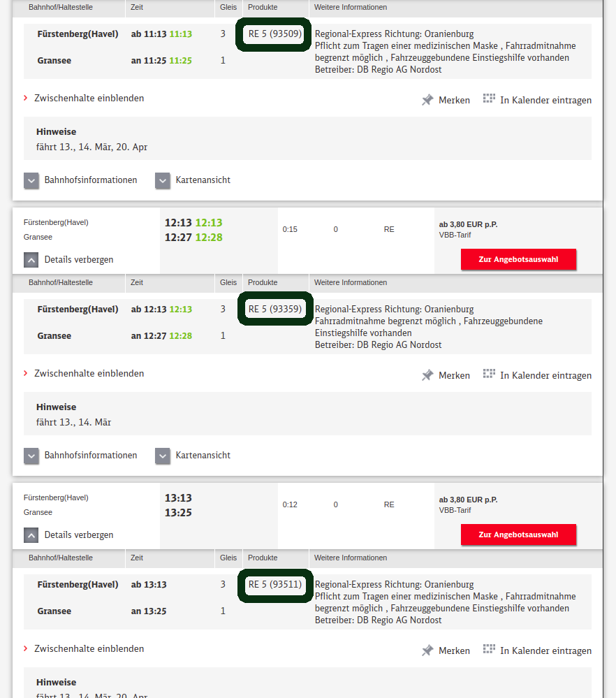
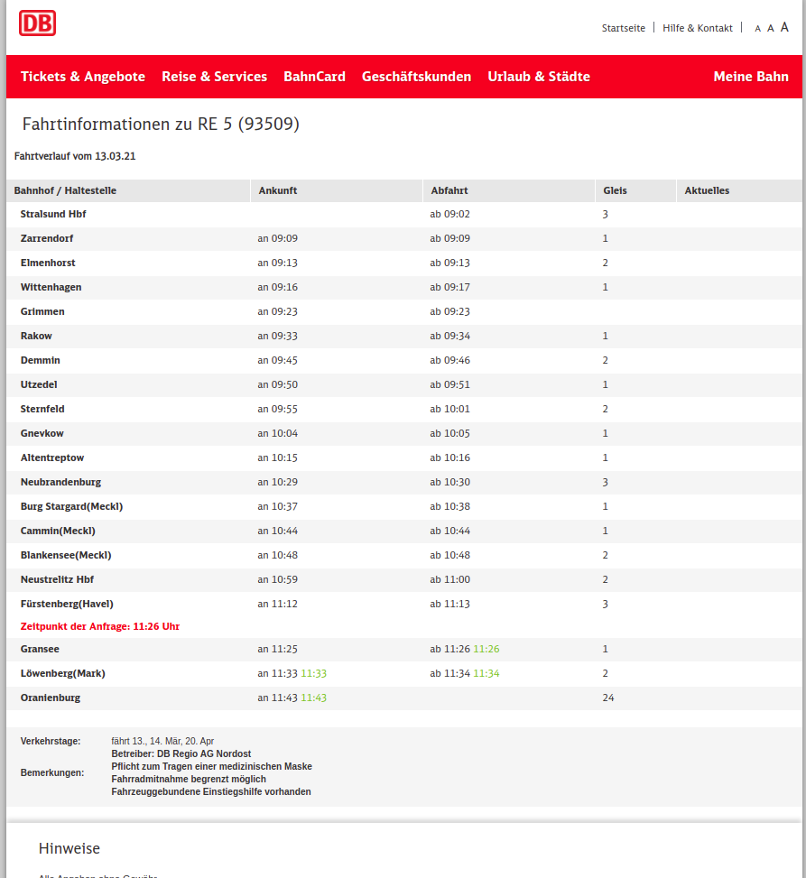
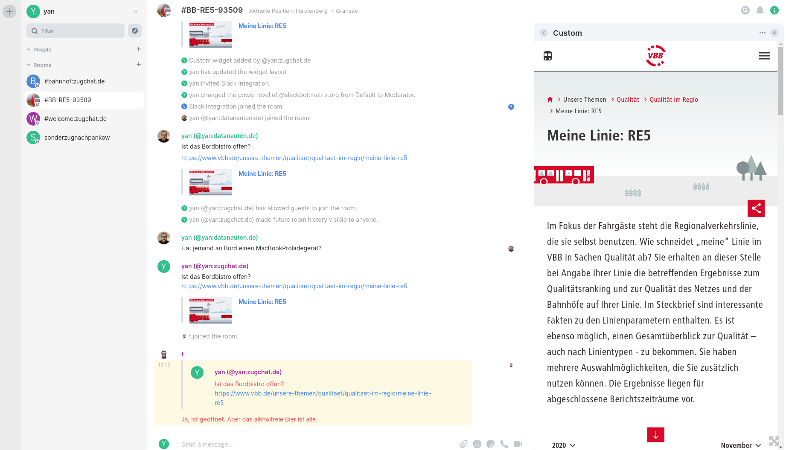
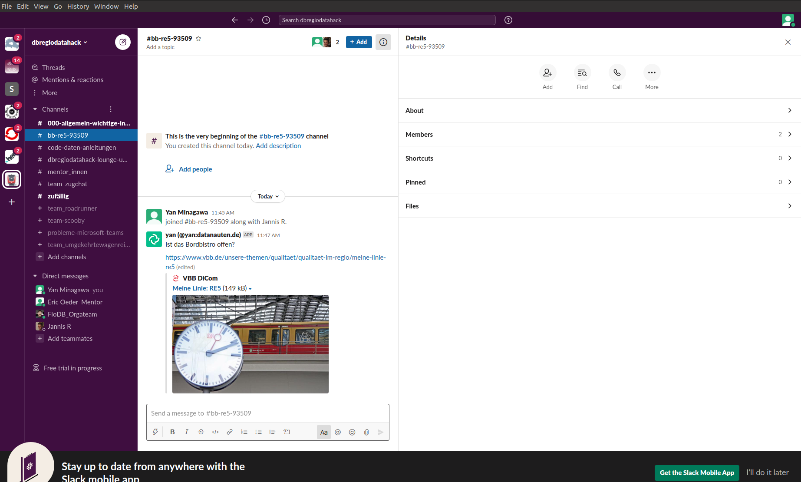

Zugchat

    
# Usecases: 
## Tasche vergessen

Nachricht an Mitfahrende die einem Zug waren oder sind.

## Wo ist der Zug

Auf einer Map sehen wo der Zug gerade ist.
Via LocationSharing oder Livetracking widget. 

## ZugTinder

Leute treffen oder kennenlernen.

## Umstiegshilfe Adhoc

Wenn man Hilfe beim Ein/Aus- oder Umstieg braucht.
siehe MobiMate

## Carpooling zum/vom Bahnhof

Adhoc oder geplantes Carsharing. Interaktion via Bots.
NoDetours, BesserMitfahrenBot

## Zuginfos

Verspätungen, ServiceInfos etc.

## Bahnhof/steig/gleis Infos

Abfahrtsmonitor. Machine2Machine

## Essen bestellen

Bei Bordrestaurant oder als Sammelbestellung bei einem Lieferdienst zum Bahnhof.

## opendataportal

Datenanfragen stellen. Datenquellen finden.

## ansprechpartnersuche

Nachrichten hinterlassen. Schaffner, Logführer oder auch Putzteam oder 

## & mehr ...

https://github.com/yncyrydybyl/zugchat/issues

# TechStack
* Synapse-Server-Config
* Elements
* Bridge
* Bots

# Naming
Grosse Frage nach Art der Namen

* https://github.com/public-transport/why-linked-open-transit-data
* https://linkedconnections.org/
* https://github.com/derhuerst/stable-public-transport-ids

Es können Aliase genutzt werden.
Es können Informationen zwischen Räumen gespiegelt werden. (geteilte Züge)

Wir fangen mal an mit dem Schema

#Bundeslandin2Buchstaben-Linie:zugchat.de 


## Navigation
Es kann Bot geben welche für die Orientierung von Verfügbaren Räumen Übersicht gibt.

z.B.in #BB-RE-5
```
> !list-live
< #BB-RE-5-93511,#RE-5-93359,RE-5-93509
```



# Access 
## Anonym
https://element.zugchat.de/#/room/#BB-RE5-93509:zugchat.de



## Als User

1. Account registieren oder Homeserver besorgen
    * https://publiclist.anchel.nl/
    * https://matrix.org/hosting/
2. #BB-RE5-93509:zugchat.de joinen


## Räume in andere Netzwerke

### Slack


![](images/re5-slack.png


### Telegram
### Whatsapp
### Signal
### Imessage

# Data

## SollFahrplan

    paket_3_2_soll_fahrplan.zip 2.3 GB / 53GB

## GTFS Positionen

* https://developer.geops.io/apis/realtime/ 

## Tools: 
* csvkit

# Bots

* https://github.com/matrix-org/matrix-appservice-bridge/blob/develop/HOWTO.md
* https://github.com/spantaleev/matrix-docker-ansible-deploy/issues/186


# Support + Team

Danke an @derhuerst, Sascha, Volker, Isabell für die ID-Disskusion

Danke an @jaller94 für den MatrixSeitigen Support

Thx für die Infos, Daten, Orga und Testuser beim #dbregiohackathon21
